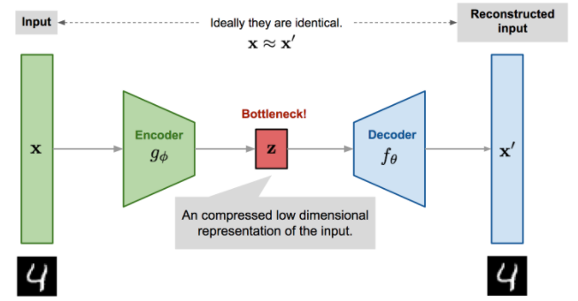

안녕하세요. 고려대학교 산업경영공학과 석사과정 이윤승 입니다. 오늘은 Dimensionality Reduction 개념을 활용한 모델을 소개하고, 직접 구현해보고자 합니다. 오늘 제가 소개할 논문은 **‘Auto-encoder based dimensionality reduction (Neurocomputing, 2016)’** 입니다. 

강필성 교수님의 비즈니스 어낼리틱스 수업 중 첫번째 챕터에서 차원축소를 위한 여러 방법론을 학습하였습니다. 원본 데이터를 변형하지 않고 변수의 부분집합만을 고르는 변수선택 방법론과 새로운 변수를 추출하는 선형적/비선형 방법론에 대해 공부하였습니다. 변수선택 방법론에는 Forward Selection, Backward Elimination, Stepwise Selection 이 포함됩니다. 선형적 변수추출을 위한 방법으로는 잘 알려진 PCA, MDS 가 있으며, 비선형적 변수추출 기법으로는 ISOMAP 과 LLE가 있습니다. 

여기서 더 나아가, 딥러닝 모델에서도 ‘차원축소’ 개념을 활용한 방법론이 있습니다. 바로autoencoder 입니다. Autoencoder는 비지도 학습의 대표적 모델로서, 원본 데이터에서 유의미한 특성을 추출하고 다시 복원하는 과정을 거치며, 의미있는 데이터 특성을 찾아내는 학습과정을 거칩니다. 
  
### 1. 논문선정 이유

이 논문에서는 autoencoder 가 어떤 부분에 초점을 두어 차원축소를 하는지를 실험을 통해 구체적으로 밝히고 있으며, autoencoder 와 수업시간에 배웠던 4가지 변수추출 방법론을 비교하는 내용도 포함하고 있습니다. 수업시간에 배웠던 개념을 응용한 autoencoder 와 4가지 방법론을 복습할 수 있는 좋은 기회가 될 수 있을 것 같아 ‘Auto-encoder based dimensionality reduction’ 를 선정하였습니다. 또한 이 논문은 2016년 Neurocomputing 학회에서 소개된 논문이며 인용수 180회를 기록하였고, autoencoder를 활용한 여러 연구논문에 인용되었습니다. 
  
### 2. AutoEncoder 란?

Autoencoder는 계산된 output 이 input 과 비슷해지도록 비지도 방식으로 학습되는 신경망을 의미합니다. 이 신경망은 크게 2가지 부분으로 나누어 볼 수 있습니다. 
  

(그림출처: https://lilianweng.github.io/lil-log/2018/08/12/from-autoencoder-to-beta-vae.html)

첫번째는 차원축소 역할을 하는 encoder 이고, 두번째는 generative model 기능을 수행하는 decoder 입니다. Encoder는 input 데이터를 latent vector로서 잘 표현해내고, decoder는 latent vector로부터 원본데이터를 복원해내고자 합니다. 이를 위해 input 과 output layer의 차원은 동일하지만, 신경망의 중간 layer 는 input, output 보다 작은 차원으로 표현되어 이를 bottleneck layer 라고 부릅니다. 또한 decoder로부터 복원한 값과 원본데이터와의 차이를 reconstruction error 라고 부르며, 이를 최소화 하는 형태로 학습이 진행됩니다. 수업시간에 배웠던 차원축소 개념이 적용되는 부분은 바로 autoencoder의 encoder 부분입니다. 
Input data를 latent vector 로 표현하기 위한 과정에서 정보의 손실이 발생하고, 이러한 손실이 차원축소의 효과를 가져오는 것입니다. 

수식을 통해 살펴보자면, encoder 는 parameter $\phi$ 로 모델링하는 함수 $g(\cdot)$ 으로 구현되고, decoder 는 parameter $\theta$ 로 모델링되는 $f(\cdot)$ 로 표현됩니다. bottleneck layer 의 경우, layer 의 output 으로서 latent vector $z$ 를 반환하며,   $z = g_{\phi}(x)$ 로 표현합니다. decoder 에 의해 복원된 데이터는 $\hat x = f_{\theta}(g_{\phi}(x))$ 로 표현할 수 있습니다.

학습할 때는 원본 데이터인 $x$ 와 모델을 거쳐서 얻은 최종 결과인 
$f_{\theta}(g_{\phi}(x))$ 의 차이를 최소화하는 parameter ($\theta, \phi$) 를 찾는 것을 통해 학습이 진행됩니다. parameter ($\theta$, $\phi$) 의 경우, reconstruction error 를 학습하는 과정에서 동시에 업데이트 됩니다. 
 
$$
L_{AE}(\theta, \phi) = \frac 1 n \sum_{i=1}^n(x^{(i)} - f_{\theta}(g_{\phi}(x^{(i)})))^2
$$

### 3. 논문에 대한 리뷰

 #### main contribution
 
 1) 기존 변수추출 방법과의 비교를 통해 autoencoder를 활용한 차원축소 효과와 그 원리에 대해 파악하였습니다.
   
 2) 데이터 기저의 차원과 hidden layer 의 노드 수를 일치하였을 때, 가장 높은 성능을 기록하였습니다. 
  

#### 

#### 실험 데이터셋

논문에서 사용한 데이터셋은 총 3가지로, 첫번째는 자체적으로 생성한 2차원 및 3차원 합성데이터(synthesized data)이고, 뒤이어 MNIST dataset과 Olivetti face dataset 를 사용하였습니다.

* 실험1 : autoencoder 차원축소 효과 및 원리 확인

 synthesize data (변수추출 방법론들과 비교)
모두 단순한 2차원 데이터 잘 표현
3차원 데이터의 경우, 평가지표인 dif 를 통해 autoencoder 가 반복되는 패턴을 학습한다는 것을 찾아낼 수 있습니다. 
또한, MNIST 와 Olivetti face dataset 을 PCA 와 autoencoder 로 차원축소 시킨 것을 비교해본 결과, autoencoder 가 edge 부분에 위치하게 축소하여 각 클래스에 대한 차원축소 성능이 뛰어난 것을 확인할 수 있었습니다. 

* 실험2 : autoencoder 의 hidden layer 노드 개수에 따라 달라지는 성능

hidden layer 의 노드 수를 증가시키며, 차원축소 성능을 확인해보았는데, 실제로 0-9 까지의 숫자클래스를 갖는 10-class MNIST 데이터의 경우, hidden layer node 를 10개로 설정하였을 때 가장 성능이 높은 것을 확인할 수 있었습니다. 반면, olivetti face dataset 는 MNIST 보다 복잡한 데이터셋이므로 hidden layer node 가 증가함에 따라 점차 성능이 높아지는 양상을 보일 뿐, 특정 노드에서 유독 높은 성능은 관찰하기 어려웠습니다. 이를 통해 실제 데이터의 기저 차원과 동일한 차원으로 latent vector 를 추출한 후 복원하면 더 좋은 성능을 내는 autoencoder 를 만들어낼 수 있음을 확인할 수 있었습니다. 
  
### 4. 논문 구현

논문에서 사용한 autoencoder 모델은 
Autoencoder 의 기본원리를 파악해보고자 numpy 만을 활용하여 구현해보았습니다. 다만, MNIST dataset 을 사용하기 위해 keras.datasets 에 내장되어 있는 mnist 만 부분적으로 활용하였습니다. 

    import numpy
    from keras.datasets import mnist
    import maplotlib.pyplot as plt

먼저 필요한 라이브러리를 임포트 합니다. 

    (x_train, y_train), (x_test, y_test) = mnist.load_data()

    # 3차원으로 표시된 데이터를 2차원으로 변경하고 학습 진행
    x_train = (x_train / 255).reshape(-1, 784)
    x_test = (x_test / 255).reshape(-1, 784)

keras 에 내장되어 있는 mnist 데이터를 train data 와 test data 로 나누어 받습니다. autoencoder 는 비지도학습이므로 실제 학습 시 활용하는 데이터는 x_train 이고, validation 오차를 계산하기 위한 용도로 x_test 를 활용할 것입니다. 
또한, 3차원으로 된 28x28 크기의 이미지를 2차원으로 바꾸어 줍니다. 

    def sigmoid(x):
        return 1 / (1+np.exp(-x))

    def relu(x):
        return np.maximum(0, x)

    # 최적의 weight 를 찾기 위해 ada optimizer 를 활용함.
    # adam optimizer 를 사용하기 위한 수식을 그대로 옮긴 것임.

    def adam_optimizer(m,r,z,dz,i):
        m[i] = beta1 * m[i] + (1-beta1) * dz[i]
        r[i] = beta2 * r[i] + (1-beta2) * dz[i]**2
        m_hat = m[i] / (1. - beta1**t)
        r_hat = r[i] / (1. - beta2**t)
        z[i] -= lr * m_hat /(r_hat**0.5+1e-12)

autoencoder 에서 사용할 함수들을 미리 선언해줍니다. 먼저 autoencoder 의 각 layer 마지막 부분에서 사용할 활성화 함수 (activation function) 입니다. 중간 레이어에서는 relu 를 사용하고, 마지막에는 sigmoid 를 사용할 것입니다. 또한, weight 를 optimize 하기 위해서 adam optimizer 를 활용할 것이므로 adam optimzier 의 정의합니다. 

> 참고: Adam Optimizer
> 

> 
> 

    encode_layers = [
        {'act': relu, 'shape': (784,512)},
        {'act': relu, 'shape': (512,256)},
        {'act': relu, 'shape': (256,128)},
        {'act': relu, 'shape': (128,100)}]

    decode_layers = [
        {'act': relu, 'shape': (100,128)},
        {'act': relu, 'shape': (128,256)},
        {'act': relu, 'shape': (256,512)},
        {'act': sigmoid, 'shape': (512,784)}]

    layers = []
    for i in encode_layers:
        layers.append(i)
        
    for j in decode_layers:
        layers.append(j)

이 논문에서는 간단한 dense layer 로 autoencoder 를 구성합니다. enocoder 에서 총 4개 layer 로 차원을 축소하며 latent vector 를 만들어내고, decoder 는 latent vector 로부터 input 과 동일한 차원의 이미지를 생성합니다. 차원이 줄어들고, 늘어나는 것은 각 layer 의 'shape' 에서 노드의 개수로 확인할 수 있습니다. 
    # 1. 공통 hyperparams 설정
    layer_num = len(layers)
    errors = []
    EPOCHS = 30
    lr = 0.002 

    # 2. adam optimizer hyperparams 설정
    # adam optimizer 계산 시, beta1 과 beta2 를 설정해주는 것 필요
    # adam optimizer 를 사용할 때 많이 쓰이는 hyperparams 로 세팅
    beta1, beta2 = 0.9, 0.999
    rw, mw, rb, mb = {},{},{},{}

    # 3. layer hyperparams 설정
    a,weights,b,func = {},{},{},{}

모델 전체에서 쓰일 hyperparameter 들을 정의해줍니다. adam optimizer 를 정의하기 위해 필요한 변수들과 affine layer 의 계산을 위한 변수들을 준비합니다. 

    # initialize the layer
    for i, layer in zip(range(1, layer_num+1), layers):
        n_in, n_out = layer['shape']
        
        # layer 의 activation function 지정
        func[i] = layer['act']
        
        # n_out * n_in 차원에 0-1 사이 값으로 random array 생성
        weights[i] = np.random.randn(n_out, n_in) / n_in**0.5
        b[i], rb[i], mb[i] = [np.zeros((n_out, 1)) for i in [1, 2, 3]]
        rw[i], mw[i] = [np.zeros((n_out, n_in)) for i in [1, 2]]

사전에 정의한 layer 와 hyperparameter 값으로 모델의 layer 를 초기화 해줍니다. 모델이 학습을 진행할 수 있도록 세팅해주는 과정이라 생각하면 될 것 같습니다. 

    def model(layer_num,i):
      for i in range(1, layer_num+1):

        # layer 하나를 계산하는 식
        # 이전에 계산한 a[i-1] 에 다음 layer의 weight 를 곱하고, 편향 b 를 더해, activation function 까지 적용함
          a[i] = func[i]((weights[i] @ a[i-1]) + b[i])

model() 은 input 을 각 layer 의 weight 와 계산해서 얻은 결과를 저장합니다. 

    # train
    for t in range(1, EPOCHS+1):
         #전체 train data 의 개수는 60000개인데, 2000개씩 데이터를 담은 batch 30개로 update 를 진행
        for batch in np.split(x_train, 30):
            a[0] = batch.T
            model(layer_num, i)

            # backpropagation 계산과정 (chain rule 위해 정의함.)
            dz, dw, db = {},{},{}
            # 마지막 layer 의 output 미분값으로부터 계산시작
            for i in range(1, layer_num+1)[::-1]:
                d = weights[i+1].T @ dz[i+1] if layer_num-i else 0.5*(a[layer_num]-a[0])
                dz[i] = d * func[i](a[i])
                dw[i] = dz[i] @ a[i-1].T
                db[i] = np.sum(dz[i], 1, keepdims = True)

            for i in range(1, layer_num):
                adam_optimizer(mw,rw,weights,dw,i)
                adam_optimizer(mb,rb,b,db,i)

        # valid
        a[0] = x_test.T
        model(layer_num, i)

        # errors 는 처음 input인 a[0] 와 복원 완료한 a[layer_num] 의 Mean Squared Error 를 사용해서 reconstruction error 를 계산
        errors += [np.mean((a[layer_num]-a[0])**2)]
        print('val loss :', errors[-1])

train data 를 1개의 batch에 2000개를 담아서 총 30번 update 를 진행하는 방식으로 설정하였습니다. weight 를 update 하는 부분은 adam optimizer 를 활용해서 backpropagation 하는 방식을 사용하였습니다. 
또한, 학습한 모델의 validation 성능평가를 위해 test data 의 reconstruction error 를 계산하였습니다. 

    # 복원된 x 를 의미
    const_x = []

    # 20개 test data 를 활용하여 시각화 진행
    a[0] = x_test[0:20].T
    model(layer_num, i)

    plt.figure(figsize = (20,5))

    # visualize input data
    for i in range(20):
        plt.subplot(6, 20, i + 1)
        plt.imshow(x_train[i].reshape(28, 28), cmap="gray")
        plt.axis("off")

    # visualize latent vector
    for i in range(20):
        plt.subplot(3, 20, i + 1 + 20)
        plt.imshow(a[4].T[i].reshape(10,10), cmap="gray")
        plt.axis("off")

     visualize reconstructed data
    y_pred = a[layer_num]
    for i in range(20):
        plt.subplot(3, 20, i + 1 + 40)
        plt.imshow(const_x.T[i].reshape(28, 28), cmap="gray")
        plt.axis("off")

    plt.show()

autoencoder 의 input 과 output 을 살펴보면, 차원이 축소된 것을 확인할 수 있습니다. 

